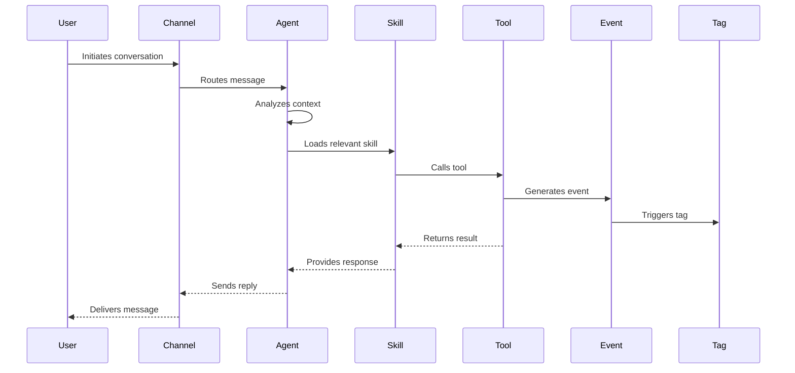

# Documentation Improvement Recommendations: Understanding the Platform

## Executive Summary

The "Understanding the Platform" section provides solid foundational coverage of Wonderful's core concepts, but it can be significantly enhanced to better serve users at different stages of their journey. This document outlines specific, actionable recommendations to improve clarity, usability, and practical value.

---

## 1. Add an Overview/Introduction Page

### Current State
- The section jumps directly into individual concept pages without a unifying introduction
- Users may not understand how concepts relate before diving into specifics

### Recommendation
**Create:** `understanding-the-platform/index.mdx`

**Content should include:**
- A visual diagram showing how all concepts connect (agents → skills → tools → events → tags → channels)
- A brief "start here" guide for different user personas (developers, product managers, operators)
- Navigation guidance: "If you're new, read in this order..." vs "If you're looking for X, go here..."
- A quick reference table mapping common goals to relevant concepts
- Links to key workflows and examples

**Why this matters:** Provides orientation and reduces cognitive load for new users.

---

## 2. Enhance Cross-Concept Relationships

### Current State
- Each concept is explained in isolation
- The "How They Work Together" section in `core-concepts-overview.mdx` is brief (only 8 lines)
- Limited examples showing concepts interacting

### Recommendations

#### A. Expand "How They Work Together" Content
**Location:** Create a dedicated page or expand existing content

**Add:**
- **Concrete workflow examples** showing a complete interaction from start to finish
  - Example: "User asks to cancel credit card" → Agent loads skill → Skill calls tool → Tool generates event → Event triggers tag → Tag routes to monitoring
- **Decision trees** for common scenarios:
  - "When should I create a skill vs. an agent tool?"
  - "When to use LLM tags vs. deterministic tags?"
  - "How do I decide between agent tools and tenant tools?"
- **Interaction diagrams** showing:
  - Message flow through the system
  - Skill loading triggers and timing
  - Event propagation and tag application
  - Tool execution sequence

#### B. Add "Related Concepts" Sections
**In each concept page, add:**
- A "Related Concepts" callout box linking to related pages
- Examples showing how this concept works with others
- Common patterns combining multiple concepts

**Example for Skills page:**
```markdown
## Related Concepts

- **Tools**: Skills often include their own tools. Learn about [skill tools](/understanding-the-platform/tools/tool-types#skill-tools)
- **Dynamic Loading**: Skills load based on context. See [dynamic loading](/understanding-the-platform/skills/dynamic-loading)
- **Tags**: Skills can trigger deterministic tags. Read about [deterministic tags](/understanding-the-platform/tags/deterministic-tags)
```

---

## 3. Add Real-World Examples and Use Cases

### Current State
- Examples are generic and brief (e.g., "Cancel Credit Card", "Create Support Ticket")
- No end-to-end scenarios showing complete workflows
- Limited industry-specific or domain-specific examples

### Recommendations

#### A. Create a "Common Patterns" Section
**New page:** `understanding-the-platform/common-patterns.mdx`

**Include:**
- **Pattern 1: Customer Support Agent**
  - Full workflow: inbound call → intent detection → skill loading → tool execution → resolution/escalation
  - Shows all concepts working together
  - Includes code/config snippets where relevant
  
- **Pattern 2: Appointment Scheduling**
  - Shows dynamic skill loading based on user needs
  - Demonstrates tool chaining (check availability → book → send confirmation)
  - Illustrates event-driven tagging for analytics

- **Pattern 3: Multi-Channel Campaign**
  - Same agent logic across voice, chat, email
  - Channel-specific adaptations
  - Unified analytics and tagging

#### B. Add "Example Scenarios" to Each Concept Page
**Enhance existing pages with:**
- More detailed, realistic examples
- Before/after comparisons (with vs. without the concept)
- Edge cases and how they're handled

**Example enhancement for Agents:**
```markdown
## Real-World Example: E-commerce Support Agent

**Scenario:** Customer calls to return a product

**Agent Behavior:**
1. Greets customer and identifies intent (return request)
2. Loads "Process Return" skill dynamically
3. Skill prompts for order number
4. Calls "Get Order Details" tool (agent tool)
5. Skill calls "Initiate Return" tool (skill tool)
6. Event generated: `return_initiated`
7. Deterministic tag applied: `return_processed`
8. LLM tag applied: `customer_satisfied` (based on tone)
9. Follow-up email sent via email channel

**Key Concepts Demonstrated:**
- Agent orchestration
- Dynamic skill loading
- Tool hierarchy (agent vs. skill tools)
- Event generation
- Tag application (deterministic + LLM)
- Multi-channel coordination
```

---

## 4. Improve Visual Communication

### Current State
- No diagrams or visual aids
- Concepts are explained purely through text
- Difficult to understand system architecture and flows

### Recommendations

#### A. Add Architecture Diagrams
**Create visual diagrams for:**
- System architecture (agents, skills, tools, events, tags, channels)
- Interaction flow (user → channel → agent → skill → tool → response)
- Skill loading decision tree
- Event propagation and tag application flow
- Tool hierarchy (system → agent → skill → tenant)

**Tools to use:** Mermaid diagrams (supported by Mintlify) or embedded images

**Example Mermaid diagram for interaction flow:**


#### B. Add Concept Relationship Diagrams
- Visual map showing how concepts connect
- Color-coded by concept type
- Interactive (if possible) or static with clear labels

---

## 5. Add Practical Guidance Sections

### Current State
- Concepts are explained but "how to use them effectively" is limited
- Missing best practices, anti-patterns, and troubleshooting

### Recommendations

#### A. Add "Best Practices" to Each Concept Page
**Structure:**
```markdown
## Best Practices

### Do's
- [Specific, actionable guidance]
- [Real examples]

### Don'ts (Anti-patterns)
- [Common mistakes to avoid]
- [Why they're problematic]

### When to Use
- [Clear decision criteria]
- [Comparison with alternatives]
```

**Example for Skills:**
```markdown
## Best Practices

### Do's
- **Keep skills focused**: Each skill should handle one specific domain (e.g., "Cancel Credit Card" not "Account Management")
- **Design for reusability**: Create skills that can be shared across multiple agents
- **Use clear naming**: Name skills after the action they perform (e.g., "Schedule Appointment" not "Calendar Helper")

### Don'ts (Anti-patterns)
- **Don't create monolithic skills**: Avoid skills that try to do too much - split into multiple focused skills
- **Don't hardcode channel logic**: Skills should work across all channels
- **Don't skip skill unloading**: Ensure skills unload when no longer needed to keep context small

### When to Use Skills
- Use skills when you need **domain-specific capabilities** that aren't always needed
- Use skills when you want to **scope tools** to specific scenarios
- Use skills when you need **focused behavior** for a particular task
- **Don't use skills** for always-needed capabilities (use agent tools instead)
```

#### B. Add "Troubleshooting" Sections
**Common issues and solutions:**
- "Why isn't my skill loading?"
- "Why are tags not being applied?"
- "How do I debug tool execution?"
- "Why is my agent not responding correctly?"

---

## 6. Enhance Navigation and Discovery

### Current State
- Linear navigation structure
- No clear learning paths
- Limited search/discovery mechanisms

### Recommendations

#### A. Add Learning Paths
**Create guided paths:**
- **"Building Your First Agent"** path: Agents → Skills → Tools → Channels → Evals
- **"Optimizing Performance"** path: Interactions → Tags → Evals → Monitoring
- **"Multi-Channel Deployment"** path: Channels → Agent Settings → Channel Configuration

**Implementation:** Add callout boxes or a dedicated "Learning Paths" page

#### B. Add Quick Reference Cards
**At the top of each section, add:**
- Quick definition (1-2 sentences)
- Key use cases (bullet points)
- Related concepts (links)
- Common questions (expandable)

#### C. Improve Cross-References
- Add "See also" sections
- Use consistent linking patterns
- Add breadcrumbs or "You are here" indicators

---

## 7. Add Comparison and Decision-Making Content

### Current State
- Limited guidance on choosing between alternatives
- No side-by-side comparisons

### Recommendations

#### A. Create Comparison Tables
**New page:** `understanding-the-platform/concept-comparisons.mdx`

**Include comparisons:**
- Agent Tools vs. Skill Tools vs. Tenant Tools
- LLM Tags vs. Deterministic Tags
- Base Skills vs. Dynamic Skills
- Inbound vs. Outbound Interactions

**Example format:**
```markdown
## Agent Tools vs. Skill Tools

| Aspect | Agent Tools | Skill Tools |
|--------|-------------|-------------|
| **Availability** | Always available | Only when skill is loaded |
| **Scope** | Agent-wide | Skill-specific |
| **Use Case** | Core integrations | Domain-specific actions |
| **Performance** | Always in context | Loaded on demand |
| **Best For** | CRM, payment processors | Task-specific APIs |
```

#### B. Add Decision Trees
- Visual or text-based decision trees
- "If X, then use Y" guidance
- Common scenarios and recommended approaches

---

## 8. Enhance Channel Documentation

### Current State
- Channel pages are somewhat generic
- Limited differentiation between channels
- Missing channel-specific best practices

### Recommendations

#### A. Add Channel Comparison Matrix
**Show:**
- Capabilities per channel (real-time, async, media support, etc.)
- Use cases best suited for each channel
- Limitations and considerations
- When to use which channel

#### B. Add Channel-Specific Examples
- Voice: Show conversation flow with timing considerations
- Chat: Demonstrate rich media and formatting
- Email: Show async patterns and threading
- WhatsApp: Highlight messaging-specific features

#### C. Add "Channel Selection Guide"
- Decision criteria for choosing channels
- Multi-channel strategies
- Channel migration patterns

---

## 9. Strengthen the Interactions Section

### Current State
- Good foundational content
- Missing practical examples of interaction analysis
- Limited guidance on using interaction data

### Recommendations

#### A. Add "Analyzing Interactions" Content
**New page or section:**
- How to read interaction transcripts
- What to look for in tool calls
- How to interpret events and tags
- Using interactions for debugging
- Extracting insights from interaction data

#### B. Add Interaction Examples
- Sample interaction with annotations
- Breakdown of what happened and why
- Common interaction patterns
- Edge cases and how they're handled

---

## 10. Improve the Evals Section

### Current State
- Good conceptual coverage
- Missing practical examples of eval creation
- Limited guidance on eval strategy

### Recommendations

#### A. Add "Creating Effective Evals" Guide
**Content:**
- How to write good test scenarios
- What to test (happy paths, edge cases, error handling)
- How to define expected outcomes
- Eval organization and maintenance

#### B. Add Sample Evals
- Real eval examples with explanations
- Before/after comparisons
- Common eval patterns
- Industry-specific eval examples

#### C. Add "Eval Strategy" Content
- When to create evals
- How many evals to create
- Eval coverage best practices
- Continuous improvement with evals

---

## 11. Add "Getting Started" Workflows

### Current State
- No step-by-step workflows in the "Understanding" section
- Users must jump to other sections for practical steps

### Recommendations

#### A. Add "Your First Agent" Walkthrough
**New page:** `understanding-the-platform/getting-started-workflow.mdx`

**Include:**
- Step-by-step guide building a simple agent
- Shows all concepts in action
- Links to detailed pages for each step
- Common pitfalls and how to avoid them

#### B. Add "Common Workflows" Section
- "Setting up a support agent" workflow
- "Creating a scheduling agent" workflow
- "Building a multi-channel campaign" workflow

---

## 12. Enhance Metadata and SEO

### Current State
- Basic titles and descriptions
- Could be more descriptive and searchable

### Recommendations

#### A. Improve Page Metadata
- More descriptive titles (include key terms)
- Better descriptions (include use cases)
- Add keywords for searchability

#### B. Add FAQ Sections
- Common questions per concept
- Expandable Q&A format
- Links to detailed answers

---

## Priority Recommendations (Quick Wins)

If you need to prioritize, start with these high-impact improvements:

1. **Add Overview/Introduction Page** (Section 1) - Provides immediate orientation
2. **Add Real-World Examples** (Section 3) - Makes concepts concrete and relatable
3. **Add Visual Diagrams** (Section 4) - Significantly improves comprehension
4. **Add Best Practices** (Section 5) - Provides immediate practical value
5. **Enhance Cross-Concept Relationships** (Section 2) - Helps users understand the system holistically

---

## Implementation Suggestions

### Phase 1: Foundation (Weeks 1-2)
- Create overview/index page
- Add visual diagrams to key pages
- Enhance cross-references between concepts

### Phase 2: Depth (Weeks 3-4)
- Add real-world examples to each concept
- Create comparison tables
- Add best practices sections

### Phase 3: Usability (Weeks 5-6)
- Create learning paths
- Add troubleshooting sections
- Enhance channel documentation

### Phase 4: Advanced (Weeks 7-8)
- Add common patterns page
- Create workflow guides
- Add interaction analysis content

---

## Metrics for Success

Track these metrics to measure improvement:
- **Time to first understanding**: How long until users can explain a concept
- **Bounce rate**: Are users finding what they need?
- **Cross-page navigation**: Are users following recommended paths?
- **Search queries**: What are users searching for that's not found?
- **Feedback**: User surveys on documentation clarity and usefulness

---

## Conclusion

The "Understanding the Platform" section has a solid foundation but can be significantly enhanced to better serve users. The recommendations above focus on:

1. **Orientation**: Helping users understand where they are and where to go
2. **Relationships**: Showing how concepts connect and work together
3. **Practicality**: Providing actionable guidance and real examples
4. **Visualization**: Using diagrams to improve comprehension
5. **Usability**: Making content easier to find and navigate

By implementing these improvements, the documentation will better serve both new users learning the platform and experienced users looking for specific guidance.

